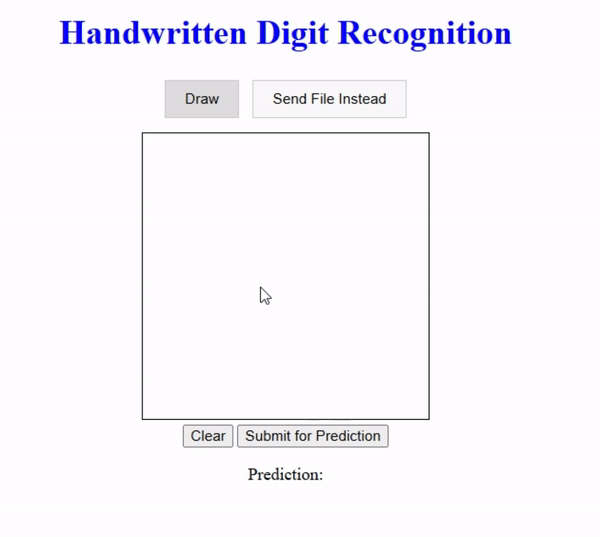

# **Handwritten Digits Recognition Web App**
This web application allows users to draw a single digit on a canvas, and the model will predict the digit.
## **Overview**
The project demonstrates how to integrate a Flask backend with a simple frontend for digit recognition. It covers:
- Sending user input (a drawn digit) from the webpage to the backend.
- Using a trained model to make predictions.
- Displaying the prediction result on the webpage.
  
## **Model**
The digit recognition model is built using Keras and trained on the MNIST dataset. You can easily replace it with your own model (saved with the `.keras` extension).

## **Features**
- **Draw or Upload**: Users can either draw a digit on the canvas or upload an image.
- **Prediction**: The model predicts the digit based on user input and displays the result on the webpage.
- **Customizable**: You can replace the pre-trained model with your own for different datasets.

## **Image Preprocessing (to be optimized)**

The input image undergoes several preprocessing steps to match the format expected by the model (28x28 grayscale). Future optimizations are planned to improve accuracy and speed.

## **Usage**

1. Clone or download the repository.
2. Install the required dependencies (see *requirements.txt*).
3. Run the Flask app:  
   `python app.py`
4. Open the webpage in your browser and start drawing a digit or upload an image for prediction.

## **Screenshot**  

